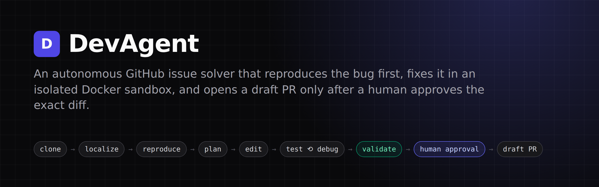
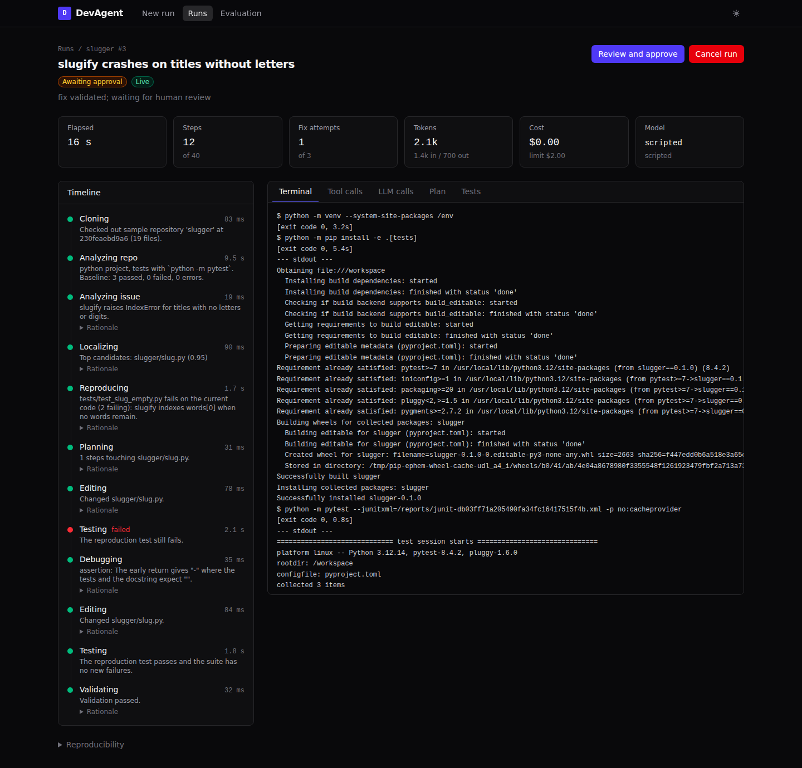
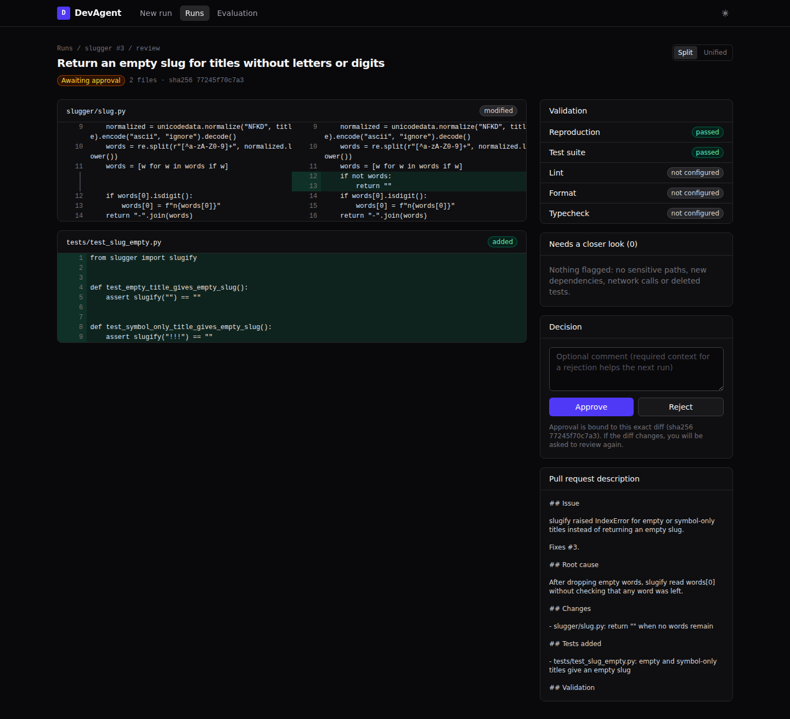
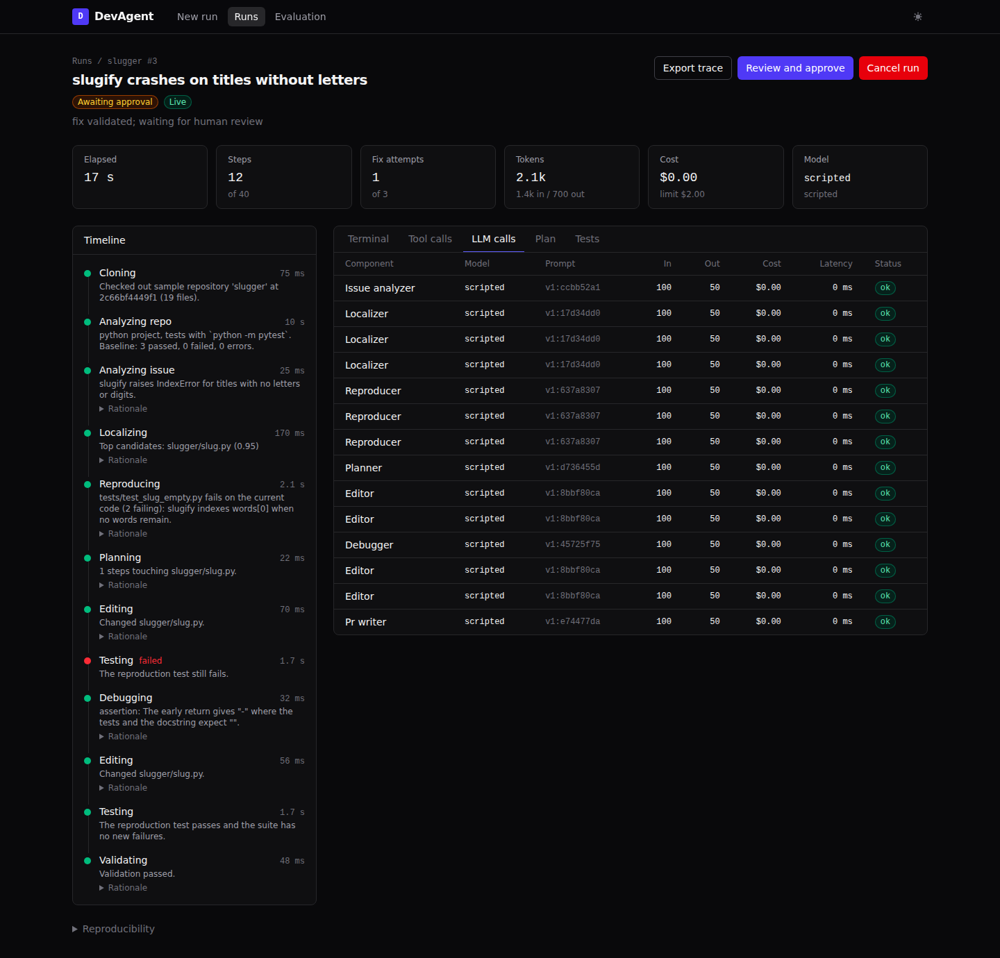
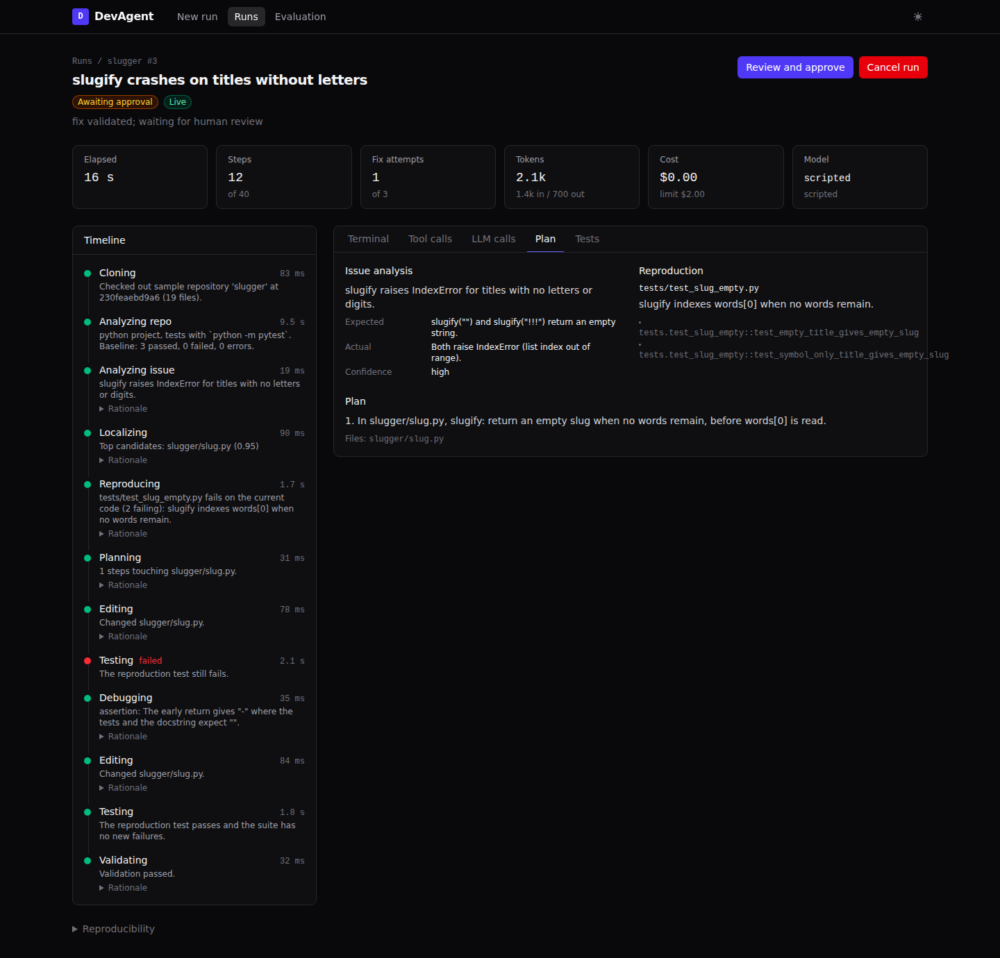
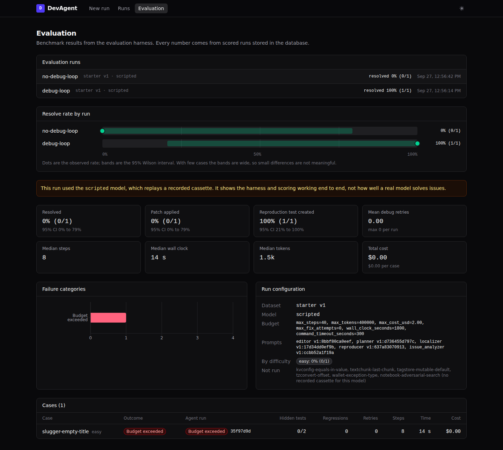
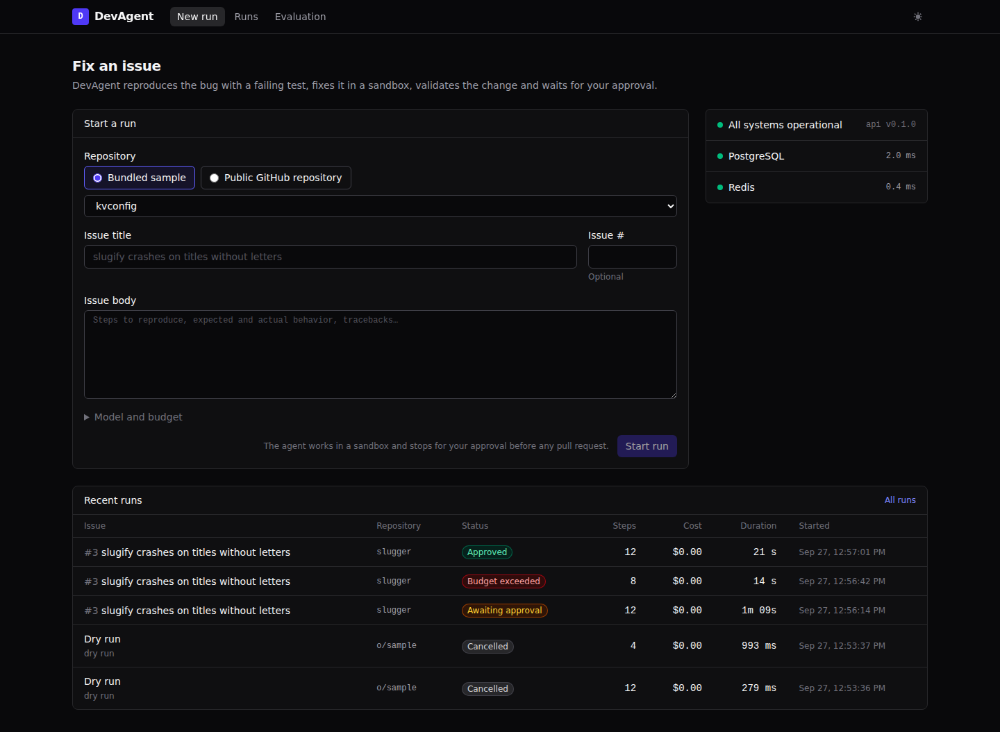
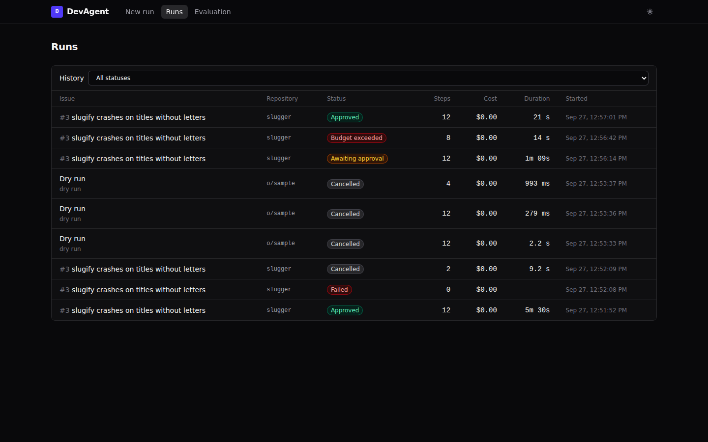
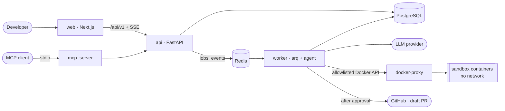
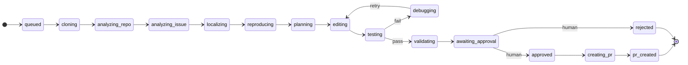

<p align="center">
  
</p>

<p align="center">
  <a href="https://github.com/ArjunShuklaCSE/DevAgent/actions/workflows/ci.yml"></a>
  
  
  
  
  
  
  <a href="LICENSE"></a>
</p>

**DevAgent** takes a Python repository and a GitHub issue. It finds the relevant code,
writes a test that reproduces the bug, plans and applies a fix, and validates it in an
isolated Docker sandbox, retrying within a budget when tests fail. It then stops and
shows a person the exact diff, and opens a **draft** pull request only after that
person approves it.

It is built to show agent engineering done carefully: typed tools with path safety,
sandboxed execution with no network, budgets enforced before every action,
prompt-injection defences backed by capability limits, a full trace of every decision,
and a benchmark harness that reports only numbers it measured.

---

## Contents

[Demo](#demo) · [Features](#features) · [Architecture](#architecture) ·
[Quick start](#quick-start) · [Usage](#usage) · [Configuration](#configuration) ·
[Security model](#security-model) · [Evaluation](#evaluation) ·
[Benchmark results](#benchmark-results) · [Limitations](#limitations) ·
[Documentation](#documentation)

## Demo

> 🎥 **Demo video:** not recorded yet.

All screenshots below are from real runs on the bundled `slugger` sample, using the
key-free `scripted` model (a recorded model session replayed against the live
sandbox).

**Live run.** The timeline follows the state machine. The terminal streams sandbox
output. Here the debug loop catches a wrong first fix, and the second attempt passes.

<p align="center"></p>

<table>
  <tr>
    <td width="50%"><b>Review and approve.</b> A GitHub-style diff, validation results and review flags. Approval is bound to the diff's SHA-256.<br><br></td>
    <td width="50%"><b>Every model call.</b> Prompt version, tokens, cost, latency and the model's short rationale.<br><br></td>
  </tr>
  <tr>
    <td width="50%"><b>The plan</b>, shown before any edit is made, with the reproduction test the agent confirmed fails.<br><br></td>
    <td width="50%"><b>Evaluation.</b> Stored benchmark runs, resolve rate with 95% Wilson intervals, failure categories, and per-case links to traces.<br><br></td>
  </tr>
  <tr>
    <td width="50%"><b>Start a run</b> on a GitHub repository or a bundled sample, pasting an issue or picking an open one.<br><br></td>
    <td width="50%"><b>Run history</b>, with status, steps, cost and duration.<br><br></td>
  </tr>
</table>

## Features

- **Reproduction first.** The agent must write a test that *fails* on the unmodified
  code before it may attempt a fix. That test must pass afterwards, and it is
  read-only to the editor, so the fix cannot pass by weakening it.
- **Explicit state machine.** Every step is recorded and streamed, and the transition
  table rejects anything else. The debug and retry loop is bounded.
- **The orchestrator judges; the model proposes.** Pass or fail comes from JUnit
  results compared against a baseline run, never from the model's own claim.
- **Sandboxed execution.** One container per command: non-root, no capabilities,
  read-only root, resource limits, and **no network** except during dependency
  install. The worker reaches Docker only through a filtering proxy.
- **Typed tools with path safety.** Search, symbol lookup, line-ranged reads, exact
  single-match edits, and an allowlisted command policy (argv only, no shell).
- **Budgets enforced before acting:** steps, fix attempts, tokens, dollar cost (from a
  pricing file) and wall clock.
- **Prompt-injection defence in layers.** Untrusted content is wrapped and labelled,
  output must match a schema, and injection attempts are flagged. Above all, the model
  has no capability to push, reach the network or read secrets.
- **Human approval bound to a hash.** A stale diff is refused. PRs are drafts built
  through the GitHub Git Data API, so the token never touches a clone. When no PR can
  be opened, a `git am` patch is offered instead.
- **Full observability.** Every model call, tool call, command, test and decision is
  stored and streamed over SSE with `Last-Event-ID` resume, and exportable as one JSON
  trace.
- **Honest evaluation.** Hidden tests run in a fresh sandbox, results are sorted into a
  failure taxonomy, rates carry Wilson intervals, and an ablation compares runs with
  and without the debug loop.
- **MCP server** exposing read-only code tools and run control, deliberately without
  approval.
- **Provider-agnostic LLM layer** (Anthropic and OpenAI adapters), plus a deterministic
  `ScriptedLLM`, so the whole test suite runs without API keys.

## Architecture





Any active state can also end in `failed`, `budget_exceeded`, `timed_out` or
`cancelled`. The full picture, with the run sequence diagram and dependency rules, is
in [docs/architecture.md](docs/architecture.md).

### Tech stack

| Area | Choice |
| --- | --- |
| API | Python 3.12, FastAPI, Pydantic v2, SQLAlchemy 2 (async), Alembic |
| Data and jobs | PostgreSQL 16, Redis, arq |
| Live updates | Server-Sent Events with `Last-Event-ID` replay |
| Agent | Explicit state machine, versioned prompts, structured outputs |
| LLM | Provider-agnostic `LLMClient` (Anthropic, OpenAI), `ScriptedLLM` for tests |
| Sandbox | Docker SDK, a filtering Docker API proxy, pinned sandbox image |
| Code search | ripgrep and Python `ast` |
| Frontend | Next.js 16, TypeScript (strict), Tailwind CSS 4, TanStack Query, Recharts, react-diff-view |
| Integrations | GitHub OAuth and Git Data API, Model Context Protocol server |
| Quality | uv, ruff, mypy (strict), import-linter, pytest, pnpm, ESLint, Prettier, Vitest, Playwright, pre-commit, GitHub Actions |

## Quick start

Requirements: Linux or macOS with Docker (Compose v2). Nothing else is needed to run
it.

```bash
git clone https://github.com/ArjunShuklaCSE/DevAgent.git
cd DevAgent
docker compose up -d --build --wait     # first build takes a few minutes
```

Then open **http://localhost:3000**.

To see a complete run without any API key:

1. On the home page, keep **Bundled sample** selected and choose **slugger**.
2. Set **Issue title** to *slugify crashes on titles without letters* and **Issue #**
   to 3. Open **Model and budget** and type `scripted` as the model.
3. Click **Start run** and watch it live. It reproduces the bug, makes a wrong first
   fix, debugs, fixes it, and stops at **Awaiting approval**.
4. Click **Review and approve**, approve, and download the patch. A sample has no
   GitHub remote, so DevAgent offers a patch instead of opening a PR.

To solve real issues, add a model and its key to `.env` (see below) and restart with
`docker compose up -d`.

| Service | Address |
| --- | --- |
| Dashboard | http://localhost:3000 |
| API and OpenAPI docs | http://localhost:8000/docs |
| Health | http://localhost:8000/health |

## Usage

### Dashboard
Choose a repository (a public GitHub URL, or a bundled sample), pick an open issue or
paste one, and set the budget: model, maximum cost, steps and fix attempts. Follow the
run live, review the diff, and approve or reject it. Approval opens a draft PR from
`devagent/issue-<n>-<slug>` when a GitHub token with write access is available;
otherwise it offers the patch.

### API

```bash
REPO=$(curl -s -X POST localhost:8000/api/v1/repositories \
  -H 'content-type: application/json' -d '{"sample":"slugger"}' | jq -r .id)
RUN=$(curl -s -X POST localhost:8000/api/v1/runs -H 'content-type: application/json' \
  -d "{\"repository_id\":\"$REPO\",\"model\":\"scripted\",\"issue\":{\"number\":3,\"title\":\"slugify crashes on titles without letters\"}}" \
  | jq -r .id)
curl -N localhost:8000/api/v1/runs/$RUN/events          # live SSE stream
curl -s localhost:8000/api/v1/runs/$RUN/trace -o trace.json
```

Every endpoint is listed in [docs/api.md](docs/api.md).

### MCP server

Expose a local checkout's read-only code tools and DevAgent's run control to any MCP
client (for example, Claude Desktop or an IDE assistant):

```json
{
  "mcpServers": {
    "devagent": {
      "command": "uv",
      "args": ["run", "--directory", "/path/to/DevAgent", "devagent-mcp", "--root", "/path/to/a/git/checkout"]
    }
  }
}
```

Tools: `list_tree`, `search_files`, `search_text`, `find_symbol`, `find_references`,
`read_file`, `list_repositories`, `add_repository`, `list_runs`, `get_run`,
`start_run`, `cancel_run`, `get_run_diff` and `export_run_trace`. There is no approve
tool: approval stays with a person in the dashboard
([ADR 0019](docs/decisions/0019-mcp-server.md)).

### Benchmark

```bash
docker compose exec worker devagent eval validate --gold
docker compose exec worker devagent eval run --model <model> --label baseline
docker compose exec worker devagent eval run --model <model> --label no-debug-loop --max-fix-attempts 0
docker compose exec worker devagent eval report <run-id> --compare <other-run-id>
```

## Configuration

Copy `.env.example` to `.env`. Every variable is documented there. The ones you are
most likely to set:

| Variable | Purpose |
| --- | --- |
| `DEVAGENT_LLM_MODEL` | Default model. It must have an entry in `config/model_pricing.yaml`. |
| `DEVAGENT_OPENAI_API_KEY` / `DEVAGENT_ANTHROPIC_API_KEY` | Provider keys. They stay in the API and worker processes, never in the sandbox or prompts. |
| `DEVAGENT_SECRET_KEY` | Fernet key: encrypts stored GitHub tokens and seals cookies. |
| `DEVAGENT_GITHUB_CLIENT_ID` / `_SECRET` | GitHub OAuth app for sign-in. When set, the API requires a signed-in user. |
| `DEVAGENT_GITHUB_TOKEN` | Optional fine-grained PAT for opening PRs without OAuth. |
| `DEVAGENT_PUBLIC_WEB_URL` | Public dashboard URL: PR trace links, the OAuth callback, Secure cookies. |
| `DEVAGENT_SANDBOX_CPUS` / `_MEMORY_MB` / `_PIDS` | Per-command sandbox limits. |
| `DEVAGENT_SANDBOX_RUNTIME` | Set to `runsc` to run sandboxes under gVisor. |
| `DEVAGENT_SANDBOX_INSTALL_PROXY` | Optional egress proxy for dependency installs. |

Default run budget: 40 steps, 3 fix attempts, 400k tokens, $2.00, 300 s per command
and 30 minutes per run. Each run can change it.

## Security model

DevAgent assumes the repository, the issue and the model's output may all be hostile.

| Threat | Main controls |
| --- | --- |
| Malicious repository | Hook-free shallow clone with symlinks disabled. Code runs only in the sandbox (non-root, no capabilities, read-only root, limits, no network). `.git` is hidden from the sandbox. The Docker socket sits behind an allowlisting proxy. |
| Injected instructions | Untrusted content is wrapped and labelled, outputs must match a schema, injection attempts are flagged, and an adversarial sample is part of the tests and the benchmark. |
| Compromised model | No tool can push, call GitHub, reach the network or leave the workspace. Path safety applies to every file tool, the command allowlist to every command, and budgets are checked before every action. |
| Secret leakage | Tokens live only in process environments, are encrypted at rest and redacted from logs, and never enter the workspace, sandbox or prompts (tested). |
| Unapproved changes | Only backend code writes to GitHub, and only after a human approves the exact diff hash. PRs are always drafts, and DevAgent never merges. |

The full threat model, and the gaps that remain (install-time network, shared kernel,
no per-container disk quota), are in [docs/security.md](docs/security.md).

## Evaluation

The harness runs the normal agent pipeline on cases with known fixes, then scores the
final diff in a **fresh sandbox**:

1. The diff is applied with `git apply` to a new checkout of the base.
2. Hidden tests, which the agent never saw, are written on top.
3. Dependencies are installed from scratch, and only the fail-to-pass (F2P) and
   pass-to-pass (P2P) tests run.

A case is **resolved** when the patch applies, every F2P test passes, no P2P test
regresses, and (for the adversarial case) none of the injected actions happened.
Failures are sorted into a taxonomy: environment, localization, reproduction,
incorrect fix, regression, invalid patch, budget exceeded, timeout, infra.

The starter dataset has **7 cases**, one real bug per sample repository, including one
adversarial repository with injections in its README, code and issue. Every case is
checked with `devagent eval validate --gold`: on the base code its hidden tests fail;
with the reference fix they pass. Details: [docs/evaluation.md](docs/evaluation.md).

## Benchmark results

> **No real model has been benchmarked yet.** The only stored results come from the
> `scripted` model, which replays one recorded session. They show that the harness,
> scoring and ablation work end to end. They say nothing about how well a model
> solves issues.

From the generated report
[`evaluation/reports/starter-scripted-ablation.md`](evaluation/reports/starter-scripted-ablation.md)
(scripted model; only the `slugger` case has a recording, so the other 6 cases were not
run):

| Configuration | Resolved | Debug retries | Steps | Tokens |
| --- | --- | --- | --- | --- |
| With debug loop | 1/1 (95% CI 21% to 100%) | 1 | 12 | 2,100 |
| Without debug loop (`--max-fix-attempts 0`) | 0/1 (95% CI 0% to 79%), budget exceeded | 0 | 8 | 1,500 |

With n = 1 the intervals are as wide as they look. Results for a real model will
replace this section once a run exists.

## Limitations

- **Python and pytest only** in v1. The analyzer, test-runner detection and sandbox
  image are pluggable for JavaScript and TypeScript later.
- **Public repositories only for solving**, because cloning is anonymous. PRs and issue
  import work wherever the token has access.
- **Single user.** There are no teams, roles or multi-tenant isolation.
- **Install-time network is open** by default (bridge network, or your proxy). Agent
  commands and tests never have network access.
- **Evaluation cases must be bundled samples.** Pinned GitHub commits and SWE-bench
  Lite are not supported yet.
- No real-model benchmark and no live PR on a real repository have been recorded yet.
  Both need credentials this repository does not have.

## Future work

- JavaScript and TypeScript adapters (npm or pnpm with jest or vitest).
- An egress allowlist for dependency installs, and gVisor by default.
- GitHub App installation tokens. Private-repository cloning without the token in the
  workspace.
- A SWE-bench Lite loader, and more starter cases.
- OpenTelemetry spans exported over OTLP, and a LangGraph orchestrator adapter behind
  the existing interface.

## Documentation

| Document | Contents |
| --- | --- |
| [docs/architecture.md](docs/architecture.md) | Services, packages and dependency rules, state machine, run sequence |
| [docs/security.md](docs/security.md) | Threat model, controls, known gaps |
| [docs/evaluation.md](docs/evaluation.md) | Dataset format, leakage rules, scoring, adding a case, reproducing results |
| [docs/api.md](docs/api.md) | REST endpoints, SSE events, examples |
| [docs/deployment.md](docs/deployment.md) | Running on a single VM with Compose |
| [docs/decisions/](docs/decisions/) | 19 architecture decision records |
| [CONTRIBUTING.md](CONTRIBUTING.md) | Setup, tests, conventions |
| [PROGRESS.md](PROGRESS.md) | Build log by phase |

## Development

```bash
uv sync && uv run pre-commit install
uv run pytest                    # unit and security tests: no services, no API keys
uv run pytest -m integration     # needs `docker compose up`
uv run ruff check . && uv run mypy && uv run lint-imports
cd frontend && pnpm install && pnpm lint && pnpm typecheck && pnpm test
```

## License

[MIT](LICENSE)
