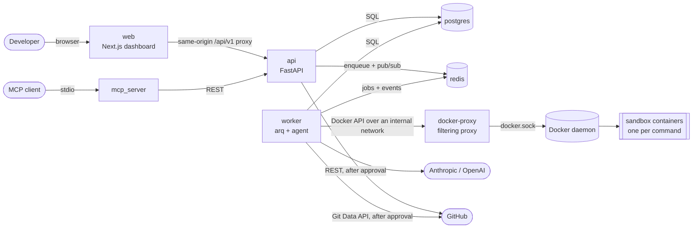
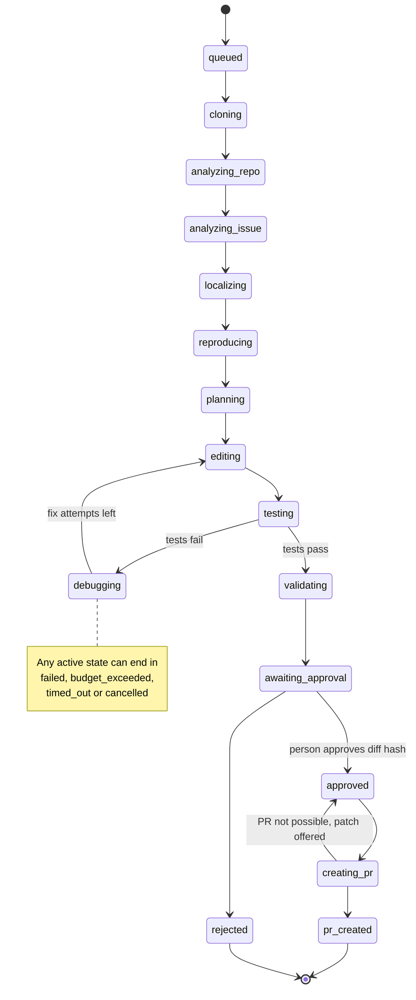
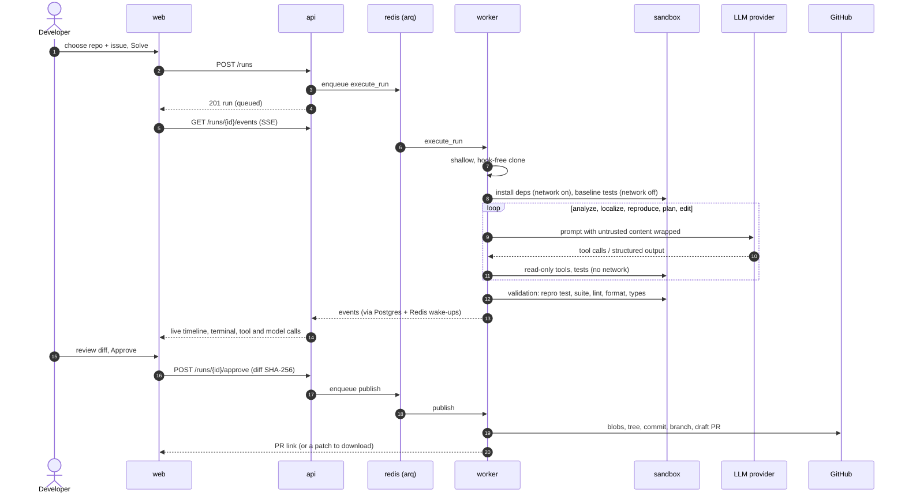

# Architecture

DevAgent takes a repository and an issue and returns a validated diff for a person to
approve. This page covers the parts, how a run flows through them, and the rules that
keep them apart. Decisions and their alternatives are in [decisions/](decisions/).

## Services

| Service | Role |
| --- | --- |
| `web` | Next.js dashboard. It talks to the API through a same-origin proxy, so cookies and SSE work without CORS. |
| `api` | REST, SSE and GitHub OAuth. It creates runs, records approvals and serves traces; it never runs repository code. |
| `worker` | Runs agent jobs, evaluation and PR publishing. All LLM calls and all sandbox containers start here. |
| `docker-proxy` | The only holder of the Docker socket. It allows a narrow set of calls and validates every container create ([ADR 0007](decisions/0007-worker-docker-access.md)). |
| sandbox | Throwaway containers from a pinned image, one per command, with no network except during dependency install ([ADR 0012](decisions/0012-sandbox-execution.md)). |
| `postgres` | Runs, steps, events, tool calls, model calls, tests, approvals, PRs and evaluation results. |
| `redis` | The arq job queue, plus pub/sub wake-ups for the live event stream. |
| `migrate`, `sandbox-image` | One-shot services: apply migrations, build the sandbox image. |

## Packages and dependency rules

| Package | Contents |
| --- | --- |
| `core/` | Domain kernel: run statuses and transitions, event payloads, tool capabilities. It imports no other DevAgent package. |
| `workspace/` | Safe cloning and repository limits. |
| `sandbox/` | Container lifecycle, command policy, JUnit parsing, the Docker proxy. |
| `tools/` | Tool registry and tools, path safety, sensitive-path classes. |
| `llm/` | `LLMClient` interface, Anthropic and OpenAI adapters, `ScriptedLLM`, pricing, budgets, prompt layering, structured output. |
| `agent/` | Repository analyzer, orchestrator (state machine), role components, prompts, validation, PR text. |
| `backend/` | FastAPI app, services, GitHub client and publisher, worker jobs. It is the composition root. |
| `database/` | SQLAlchemy models and Alembic migrations. |
| `evaluation/` | Datasets, harness, scoring, metrics, reports, the `devagent` CLI. |
| `mcp_server/` | The MCP server. |

`import-linter` enforces the rules on every CI run (`pyproject.toml`):

- `tools`, `sandbox`, `llm` and `workspace` do not import `backend` or `agent`.
- `agent` does not import `backend`: it depends on ports (`agent/ports.py`) that the
  backend implements.
- `core` imports nothing else from DevAgent.
- `database` does not import application layers.
- The evaluation read models served by the API do not import the web layer or the
  agent.

## Run state machine

`core/run_status.py` holds the transition table. Every transition is written as an
`agent_step` and a `status_changed` event in the same transaction. Nothing reaches
`creating_pr` except from `approved`, and only a recorded human decision reaches
`approved`.

## A run, step by step

## Agent components

The orchestrator (`agent/orchestrator.py`) runs one component per state. Each has a
versioned prompt in `agent/prompts/<component>/vN.md` and a Pydantic output model with
a short `rationale`.

| Component | Output |
| --- | --- |
| Repository analyzer | Static detection: language, framework, package manager, install, test, lint, format and type-check commands. |
| Issue analyzer | Expected and current behaviour, reproduction steps, suspected areas, acceptance criteria. |
| Localizer | Ranked files and symbols with evidence, found with the read tools. |
| Reproducer | A new test that must **fail** on the unmodified code before any fix is attempted. |
| Planner | Ordered steps, files to touch, risks, test strategy. |
| Editor | Edits through `edit_file` and `create_file`. The confirmed reproduction test is read-only. |
| Debugger | Failure classification and the next action, bounded by `max_fix_attempts`. |
| Validator | Deterministic: reproduction test fail→pass, no new suite failures, lint, format and types compared with the baseline, review flags. |
| PR writer | Title and body, built from recorded results only. |

The model proposes and the orchestrator judges. Pass or fail is decided by test
results parsed from JUnit XML, never by the model's opinion.

## Data and events

- Every event gets a per-run sequence number from a locked counter on the run row. The
  SSE endpoint replays from `Last-Event-ID` and then follows Redis wake-ups, so a
  reconnect never misses or repeats an event ([ADR 0009](decisions/0009-event-log-and-cancellation.md)).
- For replay, a run stores its base commit, config snapshot (budget, model,
  temperature), prompt version hashes, sandbox image digest and final diff.
- `GET /runs/{id}/trace` exports the whole run as one JSON document.

## Interfaces

- **REST and SSE:** [api.md](api.md). OpenAPI is at `/docs`.
- **MCP:** `python -m mcp_server` exposes the read-only code tools and run control
  ([ADR 0019](decisions/0019-mcp-server.md)).
- **CLI:** `devagent eval …` ([evaluation.md](evaluation.md)).
